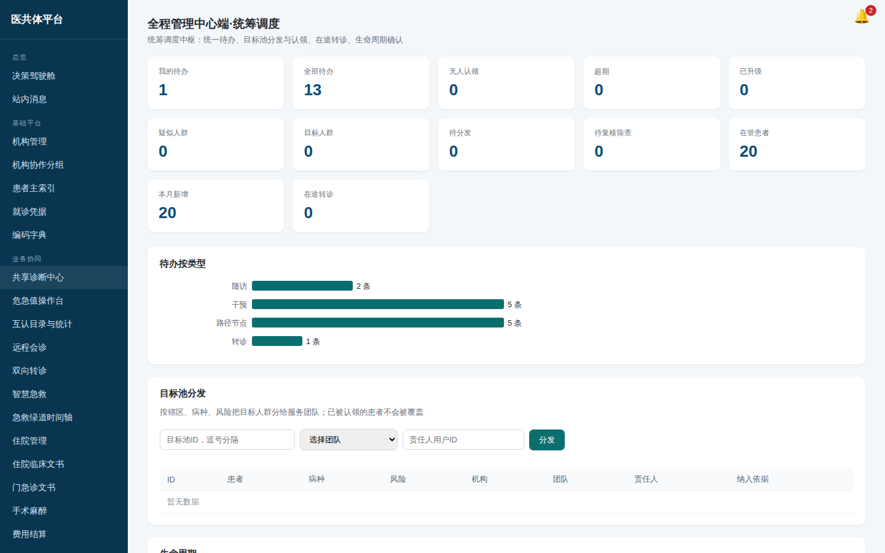
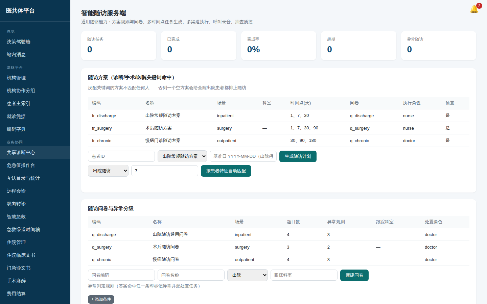
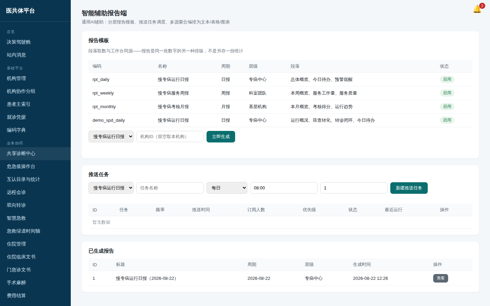

# 全程管理中心调度员培训手册（统筹调度端）

**你用的入口**：管理端「全域慢专病」→ **全程管理中心端·统筹调度**，
配合「标准路径与任务中心」「逐级转诊闭环」「智能随访服务端」三个页面。

*图：全程管理中心工作台（演示环境实截）*

## 一、每天的调度节奏

1. **看超期**：工作台超期任务/超期随访/超期复诊三个红色数字——
   三类超期由同一个扫描口径产出（每小时自动扫 + 进页面即时刷），数字与考核一致；
2. **催与升级**：任务中心按机构/团队/类型筛出超期任务，逐条或批量**催办**；
   两次催办无果的**升级**给上级（优先级自动提高）；
3. **分配目标池**：筛查确认后的待签约对象，按辖区批量**分配**到团队/个人；
   临时要给某位患者派一件事（补测血压、电话确认用药），用任务中心的**手工派发**：填患者、标题、类型、时限与责任人，
   挂纳管档案时须是这位患者、这个病种的档案；路径节点任务由路径自动派生，不在这里建；
4. **盯转诊**：超过 48 小时未推进的转诊单在转诊页有专门告警区。

*图：任务中心筛选与批量操作（演示环境实截）*

## 二、呼叫任务（智能随访服务端）

- 把随访/复诊/宣教转成**呼叫任务**：默认"人工外呼"模式，任务落台账等外呼，
  外呼后回填结果与录音地址；接通的结果自动写回随访记录；
- 接了呼叫中心网关的县：任务创建即推给网关，结果由网关回调；
  **派发失败任务留在待呼，原因记在结果里**——通道抖动不会丢任务；
- 质控抽查：按比例抽已完成随访复核，结果进随访质量统计。
- **随访方案**：「随访方案」面板里新建方案（编码、名称、场景、病种、**诊断关键词**、时间点、问卷）。出院即派生随访与
  「按患者特征自动匹配」都按诊断关键词命中，**没配关键词的方案不匹配任何人**——三套预置方案默认没配，要用先在「编辑」里补上；
  自动匹配按「回溯天数」取近几天的出院 / 就诊记录，同一位患者同一方案只排一份；平台管理员没有所属机构，要在表单里填机构 ID。

*图：呼叫任务台账（演示环境实截）*

## 三、数据源监控（平台管理端·运行中枢）

- 新接入一个院内系统：在运行中枢「数据源接入与运行监控」里**接入数据源**（编码、名称、类型、机构、接口地址、同步频率）；
  宣教素材同页「宣教素材」里新建（图文写正文，音频 / 视频填资料地址）；
- 每个接入源（HIS/公卫/体检…）有自己的同步频率，监控页看：最近同步时间、
  行数、延迟、成功率、状态（正常/延迟/异常）；
- **已登记但未接采集器**的源类型会亮出来——那是实施待办，不是故障；
- 公卫随访的血压血糖会自动同步为慢专病监测值（同一条数据不会重复入库）。

## 四、报告推送（智能辅助报告端）

1. 建**报告模板**：日报/周报/月报，段落从注册的取数口径里选
   （概况/待办/预警/工作量/质量趋势/筛查转化/转诊闭环/考核得分/指标段落）；
2. 建**推送任务**：绑模板、定推送时点、选订阅人与机构范围；
3. 到点自动生成并站内通知订阅人；**同一任务同一周期只生成一份**，
   补跑不会重复；
4. 指标段落直接复用考核指标库取数——**报表数字与考核数字同源**，
   两边对不上时先查数据，不是查系统。

*图：报告模板与推送任务（演示环境实截）*
