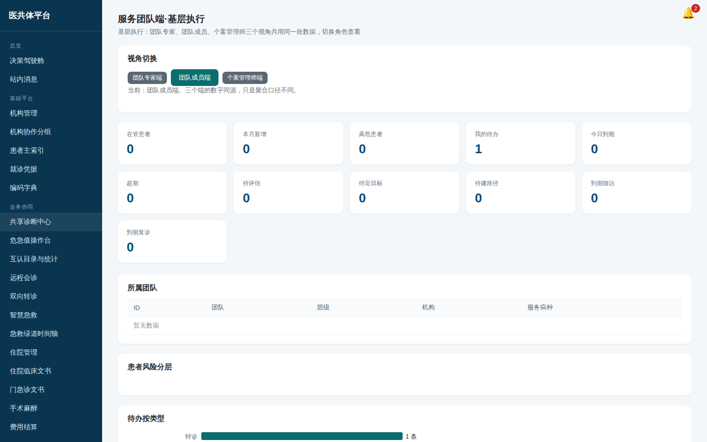
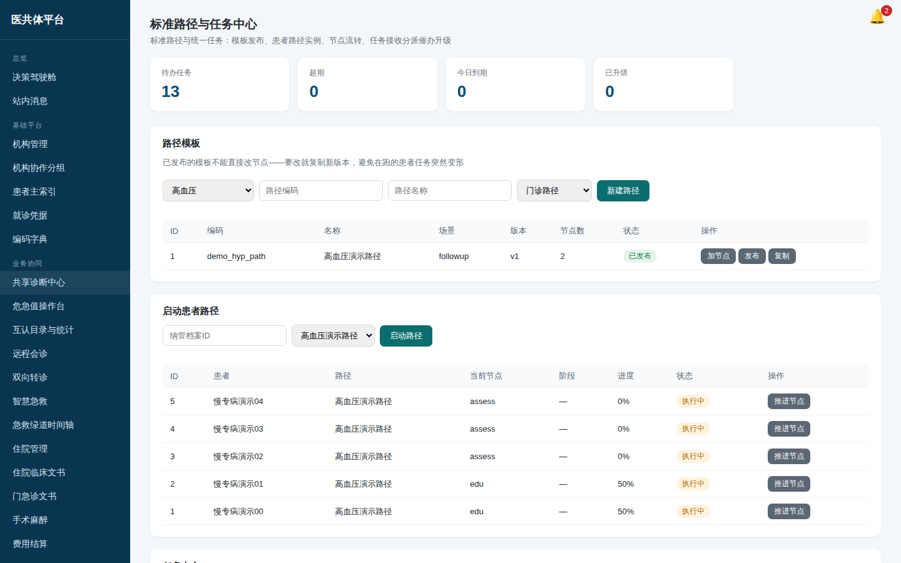
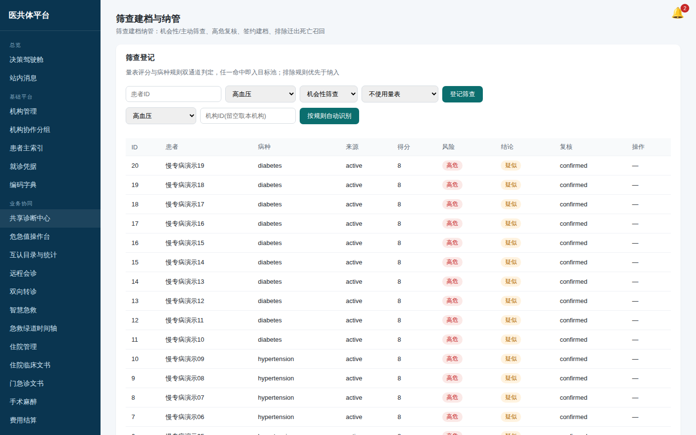

# 服务团队成员培训手册（基层执行端）

**你用的入口**：电脑浏览器打开管理端，左侧导航「全域慢专病」→ **服务团队端·基层执行**；
外勤时用医生移动端（`/m/doctor`，操作同村医手册第一、二节）。

*图：服务团队端工作台（演示环境实截）*

## 一、工作台读法

进入页面先看四组数字：

- **我的患者**：以你为主管医生的在管患者数、本月新纳管、高危人数与风险分布；
- **待办任务**：待接收/进行中/超期，超期先办；
- **待衔接事项**：还没做首评的、还没入路径的、到期随访与复诊——
  这四个数就是你今天的工作清单；
- **异常提醒**：本月异常监测值、在途转诊、召回与死亡登记。

## 二、筛查与纳管（页面：筛查建档与纳管）

1. **筛查登记**：录入患者 ID、选病种与筛查量表，提交后系统按量表评分 +
   病种纳入规则双通道判定，命中即进目标池；
2. **高危复核**：目标池里的高危对象要人工复核（确认/排除/待定），
   **筛出来不等于管起来**——确认后才允许签约；
3. **签约纳管**：填患者、病种、机构、团队与风险分级。同一患者同一病种
   只能有一份在管档案；曾被排除/迁出的可以重新纳管。

*图：筛查登记与目标池（演示环境实截）*

## 三、路径与任务（页面：标准路径与任务中心）

- 为纳管患者**启动标准路径**：选档案 ID 与已发布的路径模板，首节点任务自动生成；
- 节点任务办完路径自动往下走；下一节点设有**进入条件**（如"血压达标才进维持期"）
  而患者未达标时，路径会**暂停**并通知主管医生——处理完（如血压控制到位）后
  在路径实例上点"推进"恢复；
- 添加节点、办结任务都是弹窗表单，不再是浏览器小输入框。

*图：路径实例与任务中心（演示环境实截）*

## 四、健康宣教（页面：服务团队端）

- 选素材、勾选患者、选渠道（短信/居民端消息）推送；可设定时；
- 推送结果**如实记账**：没有手机号的患者短信会记"失败"，不会假装已送达——
  宣教覆盖率考核以"真发出去的"为分母。

## 五、患者分组

「筛查建档与纳管」页底部可建**患者分组**（个人/科室/团队），
配自动纳入规则（如"高危 + 血压未达标"）批量吸入患者，便于分层随访。

*图：患者分组与规则编辑器（演示环境实截）*
